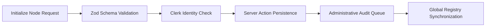
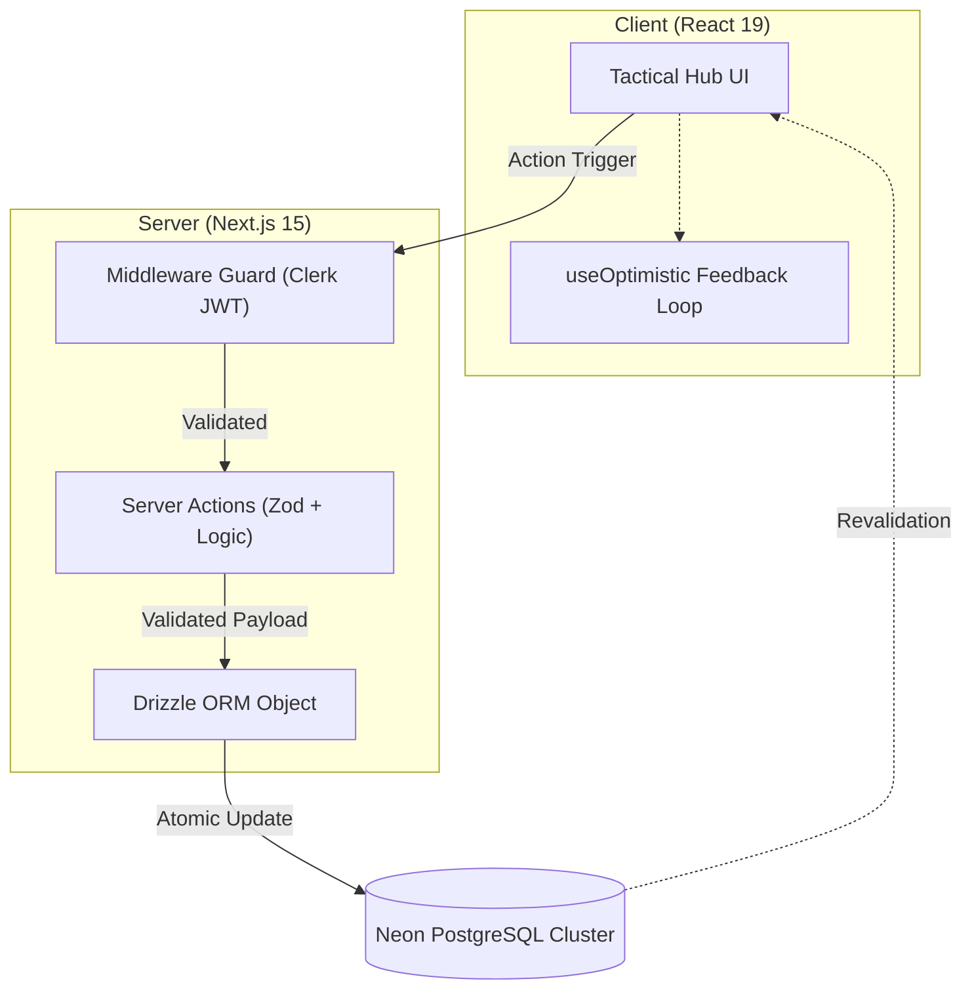
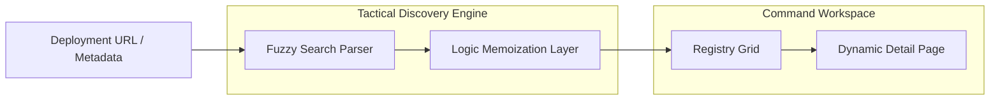

# Atlash Hub

<p align="center">
  <strong>Unified Infrastructure Registry and Deployment Control Plane.</strong>
</p>

<p align="center">
  Atlash Hub helps engineering teams solve "SaaS-Sprawl" by providing a single source of truth for fragmented digital assets.
</p>

<p align="center">
  
  
  
  
  
</p>

## Table of contents

- [What Atlash Hub is](#what-atlash-hub-is)
- [Why it feels different](#why-it-feels-different)
- [What the product returns](#what-the-product-returns)
- [How it works](#how-it-works)
- [Architecture](#architecture)
- [Repository layout](#repository-layout)
- [Important product files](#important-product-files)
- [Tech stack](#tech-stack)
- [Local setup](#local-setup)
- [Quality checks](#quality-checks)
- [Current direction](#current-direction)
- [License](#license)
- [Project Lead](#project-lead)

## What Atlash Hub is

Atlash Hub is an engineered response to the systemic failure of **Documentation Decay**. In modern enterprises, infrastructure assets (API endpoints, internal tools, and server blocks) are often scattered across disconnected environments.

Paste a deployment URL and Atlash Hub will:

1. **Verify:** Use a "Zero-Leak" TypeScript environment to ensure technical specs are accurate.
2. **Authorize:** Route new nodes through an administrative "Zero-Trust" oversight dashboard.
3. **Benchmark:** Assign a **Reliability Index** score based on peer-voted trust and performance telemetry.
4. **Discover:** Allow procurement teams and architects to find verified nodes in sub-100ms using a tactical query engine.

The goal is to reclaim the **30% of engineering time** lost to asset discovery and context switching.

## Why it feels different

Most infrastructure management relies on manual spreadsheets that go out of date the moment they are saved. Atlash Hub is intentionally different:

- **Deterministic Integrity:** It moves from "Galleries" to "Control Planes." Infrastructure isn't just listed; it's benchmarked.
- **Perceptual Speed:** Leveraging **React 19 Server Actions** and **Optimistic UI**, mutations feel instantaneous.
- **Industrial Design:** The "Midnight Forest" UI is designed for high-density data visibility, reducing ocular fatigue.
- **Schema Firewall:** Using **Zod**, we reject malformed data at the edge before it ever reaches the database.

## What the product returns

Atlash Hub answers the critical questions a Senior Architect or Procurement Officer has:

- Which infrastructure nodes are currently stable vs. "At Risk"?
- Who is the Lead Architect responsible for this asset?
- Is this endpoint compliant with our organizational standards?
- Where can I find the technical specifications for a specific deployment instantly?

The dashboard provides a **Heads-Up Display (HUD)** experience for system administrators to audit and authorize nodes in real-time.

## How it works



## Architecture

### High-level system



### Analysis pipeline



## Repository layout

```text
atlash-hub/
├── app/                # Next.js 15 App Router (Routing & Edge Logic)
│   ├── admin/          # System Oversight & Authorization Dashboard
│   ├── products/       # Registry Discovery & Dynamic [slug] pages
│   ├── submit/         # Node Initialization Pipeline
│   └── globals.css     # OKLCH Design Token Definitions
├── components/         # Atomic UI Library (React 19 Components)
│   ├── admin/          # Oversight Control UI
│   ├── products/       # Registry Grid & Telemetry Cards
│   └── ui/             # Shadcn-based tactile design system
├── db/                 # Persistence Tier (Neon Connectivity)
├── drizzle/            # SQL Migration history & metadata
├── lib/                # Tactical Engineering Layer (Logic)
│   ├── admin/          # Server Actions for Oversight
│   ├── products/       # Discovery & Indexing Logic
│   └── utils.ts        # Industrial string & style utilities
├── public/             # Branding Assets & Enterprise Symbols
├── types/              # Global TypeScript Interface definitions
├── drizzle.config.ts   # Relational Mapper Configuration
├── next.config.ts      # Framework Orchestration
└── README.md
```

## Important product files

### Infrastructure & Logic (The "Hard Logic")
- `lib/admin/admin-actions.ts` — **[use server]** The core mutation engine for approving, rejecting, and purging infrastructure nodes.
- `lib/products/product-validations.ts` — Industrial-grade Zod schemas ensuring 100% data integrity before DB ingestion.
- `db/schema.ts` — The relational "DNA" defining the synchronization between Lead Architects and Deployment Nodes.
- `drizzle.config.ts` — Orchestration for PostgreSQL schema migrations and Neon connection pooling.

### Routing & Discovery (The "HUD")
- `app/products/[slug]/page.tsx` — Dynamic SEO-optimized detail pages with React 19 Metadata orchestration.
- `app/admin/page.tsx` — The System Oversight Hub, featuring role-based server-side redirects and audit logs.
- `app/submit/page.tsx` — High-velocity node initialization pipeline with real-time schema feedback.

### UI Architecture (The "Midnight Forest")
- `components/admin/admin-actions.tsx` — Interactive moderation controls featuring state-aware loaders and confirmation protocols.
- `components/products/voting-buttons.tsx` — Implementation of the **useOptimistic** hook for sub-50ms trust-index updates.
- `components/ui/` — Hand-crafted atomic design system built on Tailwind CSS 4 and OKLCH color logic.

## Tech stack

- **Framework:** Next.js 15 (App Router / React 19 Primitives)
- **Language:** TypeScript (96.3% Coverage / Strict Mode)
- **Database:** Neon (Serverless PostgreSQL)
- **ORM:** Drizzle ORM (Type-Safe Schema-as-Code)
- **Validation:** Zod (Industrial-Grade Sanitization Firewall)
- **Auth:** Clerk (Zero-Trust Identity Orchestration)
- **Styling:** Tailwind CSS 4 (GPU-Accelerated Visual Identity)

## Local Setup

### 1. Provision Infrastructure
Ensure you have a `Neon PostgreSQL` cluster and `Clerk` project initialized.

### 2. Install Dependencies

```bash
pnpm install
```

### 3. Environment Handshake

Configure your `.env` with the following variables:

- `DATABASE_URL` (Neon Connection String)
- `NEXT_PUBLIC_CLERK_PUBLISHABLE_KEY`
- `CLERK_SECRET_KEY`

### 4. Schema Synchronization

Push your local schema definitions to the production Neon cluster:

```bash
pnpm drizzle-kit push
```

### 5. Launch Control Plane

```bash
pnpm dev
```

Access the hub at `http://localhost:3000.`

## Quality checks

- **Type Integrity:** `tsc --noEmit` ensures zero type leaks in the "Zero-Leak" architecture.
- **Audit Logic:** All Server Actions are validated against Zod schemas before SQL execution.
- **Security Guard:** `middleware.ts` enforces role-based route protection at the edge.

## Current direction

Atlash Hub is moving beyond a simple registry toward an **Active Observability Plane:**

- **Automated Health Checks:** Utilizing headless browser agents to verify node uptime in real-time.
- **Governance-as-Code:** Automated de-listing of nodes that fall below ISO 27001 or SOC2 security standards.
- **Atlash-CLI:** A dedicated developer toolkit to initialize deployments directly from local terminals.

## License

This project is licensed under the **MIT License**. See the [LICENSE](LICENSE) file for details.

## Project Lead 

Built by **[Abdul Rahman](https://github.com/ABDUL-RAHMAN-9)**  

