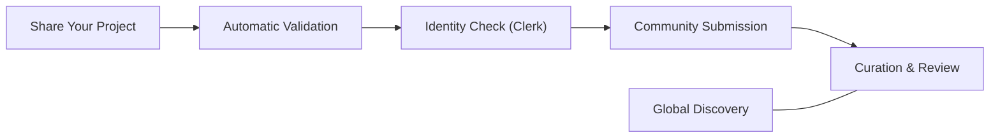

# Atlash Hub

<p align="center">
  <strong>The Community Gallery for Modern Architects & Builders.</strong>
</p>

<p align="center">
  Atlash Hub is a curated space where creators showcase their infrastructure, share their digital assets, and discover the tools powering the next generation of the web.
</p>

<p align="center">
  
  
  
  
  
  
  
</p>

## The Story Behind Atlash

In the fast-paced world of software, we build amazing things every day—API layers, infrastructure blocks, and innovative tools. But often, these creations stay hidden in private repos or lost in the noise of the internet.

We built **Atlash Hub** to bridge the "Discovery Gap." It is more than just a registry; it’s a community-driven home for your hard work. Whether you are a solo builder or part of a large team, Atlash gives your projects the visibility they deserve and helps others find verified, high-quality systems to build upon.


## Navigation

- [The Vision](#the-vision)
- [Why It Matters](#why-it-matters)
- [Community Experience](#community-experience)
- [How It Works](#how-it-works)
- [The Architecture](#the-architecture)
- [Repository Layout](#repository-layout)
- [Technology Stack](#technology-stack)
- [Getting Started](#getting-started)
- [Future Roadmap](#future-roadmap)
- [License](#license)
- [Project Lead](#project-lead)

## The Vision

Atlash Hub transforms the way we discover infrastructure. Instead of digging through outdated spreadsheets, architects can find what they need in a beautiful, real-time gallery.

1. **Showcase:** Share your project with a global community of builders.
2. **Validate:** Earn trust through community upvotes and verified status.
3. **Discover:** Find high-performance tools and systems in milliseconds.
4. **Connect:** Reach out to the architects behind the most successful deployments.

## Why It Matters

Most project directories feel like cold databases. Atlash Hub feels like a **living ecosystem**:

- **Community-First:** We moved from "galleries" to "vibrant hubs." Projects aren't just listed; they are celebrated.
- **Instant Feedback:** With **React 19** and **Optimistic UI**, every vote and interaction feels instantaneous.
- **Graceful Design:** Our "Midnight Forest" theme is built for long-term focus, using the modern **OKLCH color space** for a softer, more premium feel.
- **Human Clarity:** We've replaced complex jargon with clear, human-centric language that everyone can understand.

## Community Experience

Atlash Hub answers the questions that actually matter to builders:

- "What are people building and scaling right now?"
- "Is this tool trusted by the community?"
- "Who built this, and how can I learn from them?"
- "Where can I find a verified solution for my next project?"

## How It Works



## The Architecture

### System Flow


## Repository layout

```text
atlash-hub/
├── app/                # Next.js 16 App Router (The Home of our Pages)
│   ├── admin/          # Community Curation & Review Dashboard
│   ├── explore/        # The Global Project Gallery
│   ├── submit/         # Submission Pipeline for Creators
│   └── globals.css     # Design Tokens & OKLCH Theme Logic
├── components/         # Our Library of Visual Blocks
│   ├── landing-page/   # Hero sections & Featured highlights
│   ├── products/       # Project Cards & Discovery UI
│   └── ui/             # Atomic design system (Tailwind 4)
├── db/                 # Database Schema & Connectivity
├── lib/                # The Logic Layer (Server Actions & Utils)
├── types/              # TypeScript Interface Definitions
└── public/             # Brand Assets & Symbols
```

## Technology Stack

- **Framework:** Next.js 16 (App Router & Streaming)
- **State:** React 19 (Server Components & Actions)
- **Database:** Neon (Serverless PostgreSQL)
- **ORM:** Drizzle ORM (Type-Safe Schema)
- **Auth:** Clerk (Secure Identity)
- **Styling:** Tailwind CSS 4 (The Future of CSS)
- **Validation:** Zod (Reliable Data Integrity)

## Getting Started

### 1. Requirements
You will need a `Neon` database connection and a `Clerk` account for authentication.

### 2. Install Dependencies

```bash
pnpm install
```

### 3. Environment Setup

Configure your `.env` with the following variables:

- `DATABASE_URL=your_neon_url`
- `NEXT_PUBLIC_CLERK_PUBLISHABLE_KEY=your_key`
- `CLERK_SECRET_KEY=your_secret`

### 4. Sync the database

```bash
pnpm drizzle-kit push
```

### 5. Start the Hub

```bash
pnpm dev
```

## Future Roadmap 

Building the initial registry was just the first step. Our goal is to turn Atlash Hub from a list of links into a living, breathing brain for your infrastructure. Here is where we are heading next:

### 1. Searching for what you "mean," not just what you type
Most search bars are pretty basic—if you have a typo or don't know the exact name of a tool, you won't find it. We want to change that by using a "smart search" system that actually understands your intent.
*   **How it works:** Think of it like talking to a colleague. Instead of typing "Database-7," you could type "I need the storage tool our team uses for the mobile app," and the system will understand the context to find it.
*   **The benefit:** This stops that frustrating cycle of asking around in Slack just to find a URL. It makes discovery feel natural and human, rather than like digging through a cold database.

### 2. A "Check Engine" light for your infrastructure
Right now, we see if a tool is stable based on what people think. In the next version, the system will start looking at the history of every project to predict when something might go wrong before it actually happens.
*   **How it works:** The system will look at how often a tool has been "de-listed" or flagged in the past. It uses this history to give every project a "health score" that updates automatically.
*   **The benefit:** This gives your team an early warning. It’s much better to know a system is "getting tired" on a Tuesday afternoon than to have it crash and burn on a Sunday night.

### 3. Moving at the speed of code (The CLI)
Clicking buttons in a dashboard is great, but busy developers often prefer to stay in their terminal. We are building a dedicated Command Line Interface (CLI) so you can manage your infrastructure without ever leaving your code editor.
*   **How it works:** You’ll be able to type a simple command like `atlash deploy` to register a new project. The system will handle all the paperwork and syncing in the background for you.
*   **The benefit:** It removes the "extra step" of documentation. By making it part of your normal workflow, your registry stays up to date automatically, and nothing ever gets forgotten or lost.

### 4. An automated "Security Guard" on autopilot
Security is usually a boring manual chore, but it’s the most important part of the job. We want to implement a system that checks every project's security certificates and "health" every few minutes without a human needing to lift a finger.
*   **How it works:** The system will act like a "secret shopper," visiting your API endpoints and tools to make sure they are safe and following the rules. 
*   **The benefit:** If a tool becomes unsafe or its security expires, Atlash Hub will instantly hide it from the gallery. This keeps your entire company perimeter safe without you having to run manual audits every month.

### 5. Instant updates where you actually hang out
You shouldn't have to keep refreshing a dashboard to see what’s happening. We’re working on a "live stream" of events that pushes important news directly to the places your team already uses, like Slack or Microsoft Teams.
*   **How it works:** We are using "web-sockets," which is just a fancy way of saying the app stays "awake" and talks to your other tools the second a change happens.
*   **The benefit:** The moment a new tool is authorized or an old one is removed, your team gets a friendly notification. It keeps everyone on the same page and makes the whole company feel more connected.

## License

This project is open-sourced under the **MIT License**. See the [LICENSE](LICENSE) file for details.

## Project Lead 

Crafted with passion by **[Abdul Rahman](https://github.com/ABDUL-RAHMAN-9)**  
