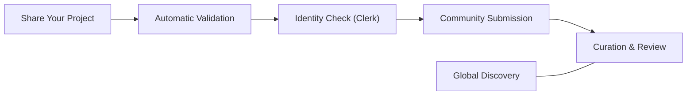
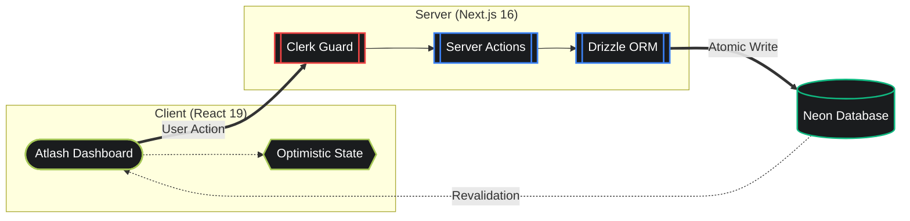

# Atlash Hub

<p align="center">
  <strong>The Community Gallery for Modern Architects & Builders.</strong>
</p>

<p align="center">
  Atlash Hub is a curated space where creators showcase their infrastructure, share their digital assets, and discover the tools powering the next generation of the web.
</p>

<p align="center">
  
  
  
  
  
  
  
</p>

## The Story Behind Atlash

In the fast-paced world of software, we build amazing things every day—API layers, infrastructure blocks, and innovative tools. But often, these creations stay hidden in private repos or lost in the noise of the internet.

We built **Atlash Hub** to bridge the "Discovery Gap." It is more than just a registry; it’s a community-driven home for your hard work. Whether you are a solo builder or part of a large team, Atlash gives your projects the visibility they deserve and helps others find verified, high-quality systems to build upon.


## Navigation

- [The Vision](#the-vision)
- [Why It Matters](#why-it-matters)
- [Community Experience](#community-experience)
- [How It Works](#how-it-works)
- [The Architecture](#the-architecture)
- [Repository Layout](#repository-layout)
- [Technology Stack](#technology-stack)
- [Getting Started](#getting-started)
- [The Future](#the-future)
- [License](#license)
- [Project Lead](#project-lead)

## The Vision

Atlash Hub transforms the way we discover infrastructure. Instead of digging through outdated spreadsheets, architects can find what they need in a beautiful, real-time gallery.

1. **Showcase:** Share your project with a global community of builders.
2. **Validate:** Earn trust through community upvotes and verified status.
3. **Discover:** Find high-performance tools and systems in milliseconds.
4. **Connect:** Reach out to the architects behind the most successful deployments.

## Why It Matters

Most project directories feel like cold databases. Atlash Hub feels like a **living ecosystem**:

- **Community-First:** We moved from "galleries" to "vibrant hubs." Projects aren't just listed; they are celebrated.
- **Instant Feedback:** With **React 19** and **Optimistic UI**, every vote and interaction feels instantaneous.
- **Graceful Design:** Our "Midnight Forest" theme is built for long-term focus, using the modern **OKLCH color space** for a softer, more premium feel.
- **Human Clarity:** We've replaced complex jargon with clear, human-centric language that everyone can understand.

## Community Experience

Atlash Hub answers the questions that actually matter to builders:

- "What are people building and scaling right now?"
- "Is this tool trusted by the community?"
- "Who built this, and how can I learn from them?"
- "Where can I find a verified solution for my next project?"

## How It Works



## The Architecture

### System Flow



## Repository layout

```text
atlash-hub/
├── app/                # Next.js 16 App Router (The Home of our Pages)
│   ├── admin/          # Community Curation & Review Dashboard
│   ├── explore/        # The Global Project Gallery
│   ├── submit/         # Submission Pipeline for Creators
│   └── globals.css     # Design Tokens & OKLCH Theme Logic
├── components/         # Our Library of Visual Blocks
│   ├── landing-page/   # Hero sections & Featured highlights
│   ├── products/       # Project Cards & Discovery UI
│   └── ui/             # Atomic design system (Tailwind 4)
├── db/                 # Database Schema & Connectivity
├── lib/                # The Logic Layer (Server Actions & Utils)
├── types/              # TypeScript Interface Definitions
└── public/             # Brand Assets & Symbols
```

## Technology Stack

- **Framework:** Next.js 16 (App Router & Streaming)
- **State:** React 19 (Server Components & Actions)
- **Database:** Neon (Serverless PostgreSQL)
- **ORM:** Drizzle ORM (Type-Safe Schema)
- **Auth:** Clerk (Secure Identity)
- **Styling:** Tailwind CSS 4 (The Future of CSS)
- **Validation:** Zod (Reliable Data Integrity)

## Getting Started

### 1. Requirements
You will need a `Neon` database connection and a `Clerk` account for authentication.

### 2. Install Dependencies

```bash
pnpm install
```

### 3. Environment Setup

Configure your `.env` with the following variables:

- `DATABASE_URL=your_neon_url`
- `NEXT_PUBLIC_CLERK_PUBLISHABLE_KEY=your_key`
- `CLERK_SECRET_KEY=your_secret`

### 4. Sync the database

```bash
pnpm drizzle-kit push
```

### 5. Start the Hub

```bash
pnpm dev
```

## The Future

We are evolving Atlash Hub from a simple gallery into an **Active Observation Platform**:

- **Real-time Monitoring:** Visualizing project health and uptime directly on the dashboard.
- **Builder Profiles:** Dedicated spaces for creators to showcase their entire portfolio.
- **Atlash CLI:** Submit and manage your projects directly from your local terminal.

## License

This project is open-sourced under the **MIT License**. See the [LICENSE](LICENSE) file for details.

## Project Lead 

Crafted with passion by **[Abdul Rahman](https://github.com/ABDUL-RAHMAN-9)**  
Building tools to help the community scale together.
